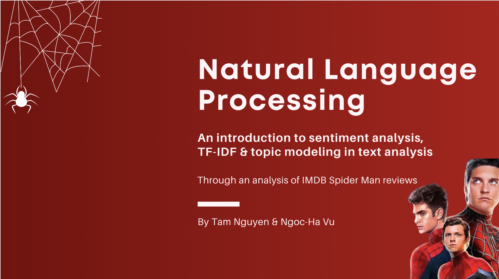

# Natural Language Processing: Spiderman Movies Review

When a product influences me in a good or a bad way I almost always want to hear other people’s experiences as well. This is certainly the case when it comes to Spider-Man for me. My first exposure to this hero was The Animated Series when I was a kid. Since then I tried to watch every Spider-Man media available. Through time I reacted differently to these media. Speaking specifically for movies, I loved and adored some of them. Some other movies couldn’t satisfy me. I also realized that people have different tastes when it comes to Spider-Man movies. Some really like The Amazing Spider-Man series, I don’t. Though I really liked seeing Andrew Garfield as Spider-Man.

After I learned a little bit about Text Analysis, I thought that analyzing this familiar topic would be a good practice. It would also quench my curiosity about other people’s reactions the these movies. I will be following the book Text Mining with R throughout this notebook. That’s a very valuable resource if you want to learn more about Text Mining.

# Table of content
This project is written in R and all detailed instructions will be in the `main.rmd` file.
    
# Installation 
The source code is written in R, from a `RMarkdown` file, a part of `R Studio`. To display the file or replicate the work/code done in the file, the installation of `RStudio` (https://rstudio.com/products/rstudio/download/) is required. 

Besides that, we used different packages, and each of them should be installed before running the `RMarkdown` file. Here are the main packages that we used in the `RMarkdown` file:
+ `tidyverse`
+ `tidytext`
+ `ggplot2`
+ `dplyr`
+ `lubridate`
+ `scales`
+ `broom`
+ `widyr`
+ `igraph`
+ `ggraph`
+ `topicmodels`
+ `patchwork`

# Important points of analysis
Although all information is included in the `Rmarkdown` file, we will display some important features <a href = "https://www.canva.com/design/DAFTHqcdjHc/jWnSph51iV7BBNXaVvvYCQ/view?utm_content=DAFTHqcdjHc&utm_campaign=designshare&utm_medium=link&utm_source=publishsharelink">here</a> as the main points of our analysis. 
